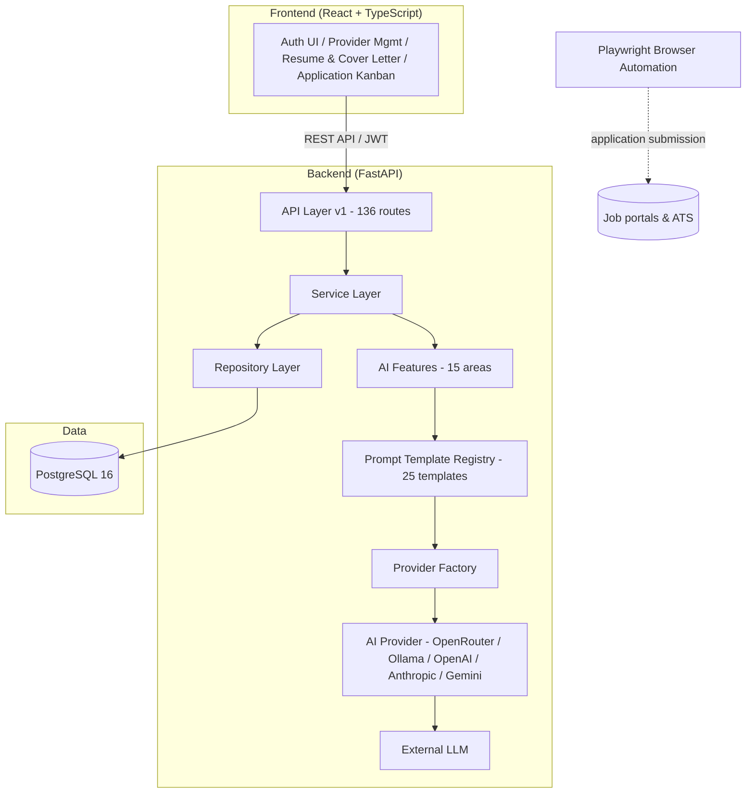
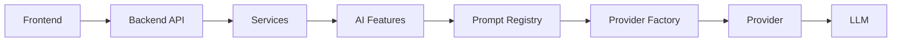
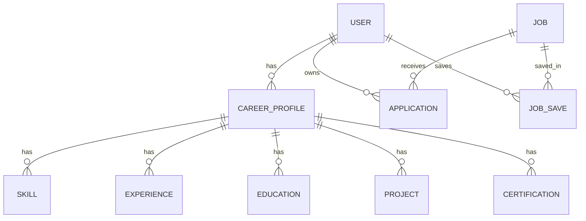
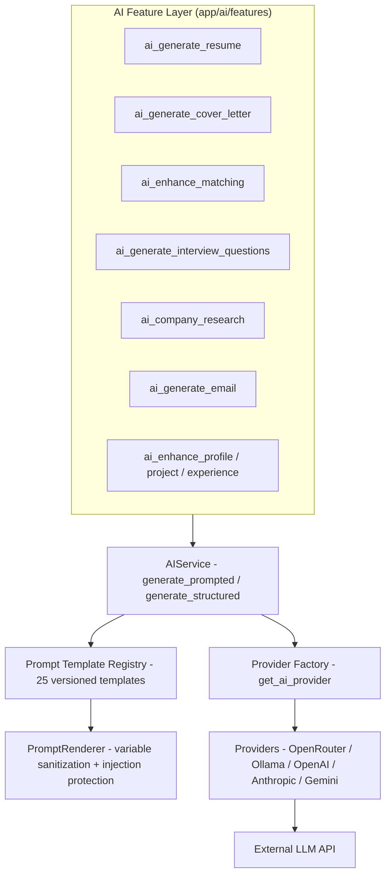
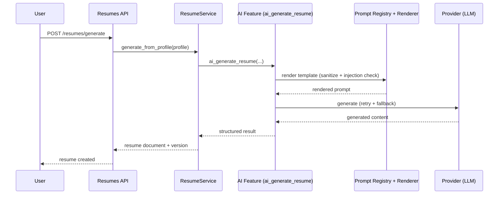
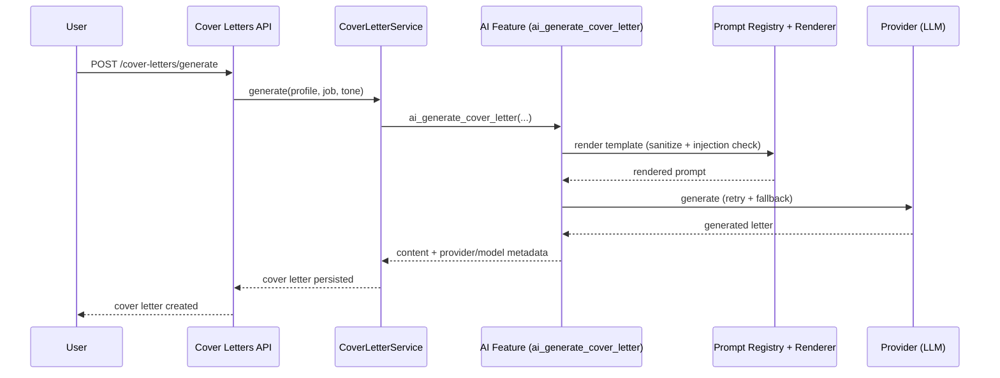
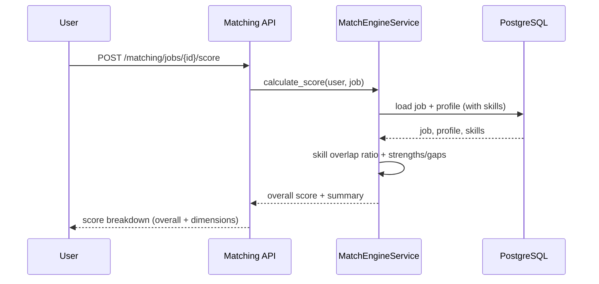

# AI Job Agent — Architecture Documentation

**Version 2.1.0**

---

## System Overview

AI Job Agent is a full-stack job application automation platform. The frontend (React + TypeScript) communicates with the backend (FastAPI) via REST API. The backend coordinates job discovery across 30+ providers, scores matches against user profiles, generates AI-powered resumes and cover letters, and manages the application lifecycle. PostgreSQL provides persistent storage. Playwright handles browser automation for form filling and submission.



### Top-level flow



```
┌─────────────────────────────────────────────────────────────┐
│                      Frontend (React + TS)                    │
│  ┌──────────┐ ┌──────────┐ ┌──────────┐ ┌────────────────┐  │
│  │ Auth UI  │ │ Provider │ │ Resume / │ │ Application    │  │
│  │ (Login,  │ │ Mgmt Ctr │ │ Cover    │ │ Engine         │  │
│  │ Register)│ │          │ │ Letter   │ │ (Kanban)       │  │
│  └──────────┘ └──────────┘ └──────────┘ └────────────────┘  │
│                        │ REST API                            │
├────────────────────────┼─────────────────────────────────────┤
│                 FastAPI Backend (Python)                      │
│  ┌────────────────────────────────────────────────────────┐  │
│  │  Production Services (Observability, Logging, Metrics)  │  │
│  ├────────────────────────────────────────────────────────┤  │
│  │  Auth Service → Discovery Engine → Provider Router     │  │
│  │  Matching Engine → Form Intelligence Engine             │  │
│  │  Browser Framework (Playwright) → ATS Providers (10)   │  │
│  ├────────────────────────────────────────────────────────┤  │
│  │  SQLAlchemy ORM → PostgreSQL 16                         │  │
│  └────────────────────────────────────────────────────────┘  │
└─────────────────────────────────────────────────────────────┘
```

---

## Folder Structure

### Root

```
├── backend/              # FastAPI Python backend
│   ├── app/
│   │   ├── api/          # Route handlers (controllers)
│   │   ├── core/         # Config, security, database setup
│   │   ├── models/       # SQLAlchemy ORM models
│   │   ├── schemas/      # Pydantic validation schemas
│   │   ├── services/     # Business logic layer
│   │   └── repositories/ # Data access layer
│   ├── alembic/          # Database migrations
│   └── tests/            # 3031+ pytest tests
├── frontend/             # React + TypeScript (Vite)
│   ├── src/
│   │   ├── components/   # Reusable UI components
│   │   ├── pages/        # Route page components
│   │   ├── hooks/        # Custom React hooks
│   │   ├── services/     # Frontend service modules
│   │   ├── api/          # API client layer
│   │   ├── types/        # TypeScript type definitions
│   │   └── utils/        # Utility functions
│   └── tests/            # 779+ vitest tests
├── docs/                 # Full documentation repository
├── docker-compose.yml    # Dev & prod stack
└── start.ps1             # Windows startup script
```

### Frontend Services (`frontend/src/services/`)

```
services/
├── provider-sdk/         # Core SDK: factory, registry, lifecycle, observability
├── provider-management/  # Management CRUD, search, filter, config
├── ats/                  # ATS provider framework + 10 implementations
│   └── providers/        # Greenhouse, Lever, Ashby, Workday, etc.
├── discovery/            # Job discovery engine, provider routing
│   └── providers/        # LinkedIn, Indeed, Naukri, etc.
├── matching/             # AI matching engine (26 files)
├── application-engine/   # Universal Form Intelligence Engine (17 files)
├── browser/              # Playwright browser automation (18 files)
├── authentication/       # Auth service, context, strategies
│   └── strategies/       # Token, session, OAuth strategies
├── production/           # Observability, logging, metrics, health, alerts
├── orchestration/        # Workflow orchestration (16 files)
├── routing/              # Provider routing, search analytics
└── portals/              # Portal provider framework
```

---

## Frontend Architecture

### Component Tree

```
<App>
  <AuthProvider>
    <BrowserRouter>
      <Routes>
        <GuestRoute>     → LoginPage, RegisterPage, ForgotPasswordPage
        <ProtectedRoute> → DashboardPage, DiscoveryPage, MatchingPage
                          → ProviderManagementPage, ResumeLibraryPage
                          → CoverLetterPage, ApplicationsPage, KanbanPage
                          → AnalyticsPage, ProductionDashboardPage
                          → CalendarPage, SettingsPage
        <Route>          → NotFoundPage, ErrorPage
      </Routes>
    </BrowserRouter>
  </AuthProvider>
</App>
```

### Data Flow

```
Page Component
      ↓
Custom Hook (useAuth, useJobs, useApplications, etc.)
      ↓
Service Layer (provider-sdk, auth, discovery, matching, etc.)
      ↓
API Client (TanStack Query / fetch)
      ↓
FastAPI Backend
```

### State Management

- **Server state:** TanStack Query (React Query) — caching, background refresh, optimistic updates
- **Auth state:** React Context (AuthProvider → useAuth hook)
- **Local UI state:** React useState / useReducer
- **Form state:** react-hook-form with zod validation

---

## Backend Architecture

Clean Architecture layers:

```
API Layer (Routes)
    ↓
Service Layer (Business Logic)
    ↓
Repository Layer (Data Access)
    ↓
Database (PostgreSQL via SQLAlchemy)
```

Dependencies always point inward. Business logic never depends on UI or external providers directly.

### Key Backend Components

- **FastAPI** — async Python web framework
- **SQLAlchemy 2.0** — async ORM with repository pattern
- **Alembic** — database migration management
- **Pydantic v2** — request/response validation
- **structlog** — structured JSON logging
- **Playwright** — browser automation
- **httpx** — async HTTP client for provider API calls

---

## Database

PostgreSQL 16 is the single source of persistence, accessed exclusively through
SQLAlchemy 2.0 (async) via the repository layer.



Key characteristics:

- **UUID primary keys** everywhere; ownership enforced at the application layer.
- **Migrations** via Alembic (`backend/alembic/`); never modify production
  schema manually.
- **Indexes** added intentionally for hot query paths (user lookups, job
  search filters, application timelines).
- **Normalized relational model**; no embedded documents.

See [docs/database/](docs/database/) for the full schema, ERD, and indexing
documentation.

---

## Provider SDK Architecture

The Provider SDK is a pluggable framework that standardizes how all job providers integrate:

```
┌─────────────────────────────────────────────────────────────┐
│                     Provider SDK                             │
├─────────────────────────────────────────────────────────────┤
│                                                             │
│  ProviderFactory → createProvider(config) → Provider         │
│       ↓                                                     │
│  ProviderRegistry → register(), get(), getAll()              │
│       ↓                                                     │
│  ProviderLifecycle → created → initialized → active          │
│       ↓                                                     │
│  ObservabilityIntegration                                   │
│  ├── createObservabilityContext()                            │
│  ├── emitProviderMetrics() / emitProviderLog()               │
│  ├── trackProviderHealth() / wrapWithObservability()        │
│       ↓                                                     │
│  RequestPipeline → execute()                                │
│  ├── In-memory caching (TTL, max entries)                    │
│  ├── Retry logic (exponential backoff)                       │
│  ├── Timeout handling                                        │
│  └── Pipeline hooks (before/after/onError)                   │
│       ↓                                                     │
│  AuthAbstraction → createAuthProvider(method)                │
│  ├── OAuth, Cookies, Credentials, Session Token              │
│  └── Browser Session                                         │
│       ↓                                                     │
│  CapabilitySystem → hasCapability(), getDescriptor()         │
│       ↓                                                     │
│  ResponseNormalizer → normalize(), validate()                │
│                                                             │
└─────────────────────────────────────────────────────────────┘
```

### Provider Types

| Type | Count | Examples |
|---|---|---|
| Discovery | 10 | LinkedIn, Indeed, Naukri, Foundit, Wellfound, Y Combinator, Google Jobs, RemoteOK, We Work Remotely, Company Career Pages |
| Portal | 7 | Internshala, Unstop, Freshersworld, LinkedIn (portal), Indeed (portal), Company Career Pages, Google Jobs |
| ATS | 10 | Greenhouse, Lever, Ashby, Workday, SmartRecruiters, BambooHR, iCIMS, Jobvite, Oracle Recruiting, SAP SuccessFactors |
| Easy Apply | 3+ | LinkedIn Easy Apply, Wellfound Easy Apply, Y Combinator Apply |

---

## Application Engine Architecture

The Universal Form Intelligence Engine automates job application submissions:

```
┌──────────────────────────────────────────────────────────────┐
│                  Application Engine                           │
├──────────────────────────────────────────────────────────────┤
│                                                              │
│  ApplicationEngine → orchestrate(formUrl, profile, documents) │
│       ↓                                                      │
│  FormEngine → detectFields(formHtml) → buildFieldMap()       │
│       ↓                                                      │
│  MultiStepCoordinator → coordinate(steps, context)            │
│  ├── Detects multi-page forms                                 │
│  ├── Manages step navigation                                  │
│  └── Handles dynamic sections                                 │
│       ↓                                                      │
│  FieldDetector → detectFields(html) → FieldDefinition[]      │
│  SemanticFieldMapper → mapField(field, profile) → FieldValue  │
│  ProfileMapper → mapProfile(profile, fields) → FieldValues   │
│       ↓                                                      │
│  AnswerEngine → generateAnswer(field, context) → Answer      │
│  DocumentSelector → selectDocument(requirement) → Document   │
│  ValidationEngine → validate(values, rules) → Validation[]   │
│       ↓                                                      │
│  CheckpointManager → save(fields, step) → restore()          │
│  RecoveryManager → recover(failedStep, context) → success    │
│  ApprovalWorkflow → summarize(changes) → approve()           │
│       ↓                                                      │
│  SubmissionManager → submit(formData) → ApplicationResult    │
│  ApplicationSummary → generate(appData) → Summary            │
│                                                              │
└──────────────────────────────────────────────────────────────┘
```

---

## Authentication Flow

```
Registration → Login → JWT issued → AuthContext updated → UI renders
                                   ↓
                            Token auto-refresh (Axios interceptor)
                                   ↓
                            Session storage (localStorage)
                                   ↓
                            ProtectedRoute checks auth → redirect to login if expired
```

### Auth Service Modules

```
authentication/
├── auth-service.ts           # Token management, login/logout/register
├── auth-context.tsx          # React context provider
├── use-auth.ts              # Auth hook for components
├── session-storage.ts       # Secure session persistence
├── token-refresh.ts         # Automatic token refresh logic
└── strategies/              # Auth strategy implementations
```

---

## AI System Architecture

All AI traffic flows through a single abstraction layer. Business logic and
feature functions never call provider SDKs directly.



### Provider Factory

`app/ai/factory.py` is the single point of provider construction:

- Reads environment configuration (`AI_PROVIDER`, API keys, base URLs, timeouts).
- Instantiates the configured provider client (`OpenRouterProvider`, `OllamaProvider`,
  `OpenAIProvider`, `AnthropicProvider`, `GeminiProvider`).
- Providers are registered **only when configured**; registration is idempotent
  and name-normalized. Unconfigured or unavailable providers report
  `UNAVAILABLE`/`NOT_IMPLEMENTED` state via `get_ai_provider_statuses()`.

### Prompt Template Registry

`app/ai/registry.py` holds the versioned catalog of prompt templates (25
registered, including 15 AI-feature templates and legacy-compat entries):

- `get(name, version)` — versioned lookup with default-latest semantics.
- `PromptTemplate` — template body, system prompt, description, required
  variables.
- `PromptRenderer` (`app/ai/prompts/renderer.py`) — fills variables, enforces a
  50KB per-variable cap, and **actively rejects prompt injection** via
  `_INJECTION_PATTERNS` before rendering. Injection attempts raise
  `RenderError`; no provider call is made.

### AIService

`app/ai/service.py` exposes the feature-facing interface:

- `generate_prompted(template_name, variables, max_tokens, ...)` — renders via
  the registry, selects a provider, applies retry and fallback routing, and
  returns the generated content with provider/model attribution.
- `generate_structured(...)` — same pipeline with schema-validated structured
  output parsing.

### Dependency Injection

Provider clients are constructed by the factory from environment
configuration and injected via `app/ai/dependencies.py`:

- `get_ai_service()` — FastAPI dependency returning the shared `AIService`.
- `get_ai_provider_statuses()` — health/state reporting used by `/ready` and
  the frontend provider management center.
- All AI feature functions (`app/ai/features/*.py`) receive the service
  through this dependency chain — no global singletons, no direct SDK access.

---

## Data Flow: End-to-End Job Discovery → Application

```
User submits search query
          ↓
DiscoveryPage → discoveryService.search(params)
          ↓
ProviderRouter routes to matching providers
          ↓
Each provider executes via Provider SDK (rate limited, cached)
          ↓
Results normalized, deduplicated, merged
          ↓
MatchingEngine scores jobs against user profile
          ↓
Sorted results displayed on DiscoveryPage
          ↓
User selects job → ApplicationEngine starts
          ↓
FormEngine detects fields → ProfileMapper fills data
          ↓
Validation → Checkpoint save → Submission
          ↓
Application tracked in history with status
          ↓
Timeline updated, analytics refreshed
```

---

## Key Workflows

### Resume Generation Workflow



### Cover Letter Generation Workflow



### Job Matching Workflow



---

## Module Responsibilities

| Module | Responsibility |
|---|---|
| `backend/app/api/` | HTTP layer — routers, request validation, standardized error envelope, auth dependencies |
| `backend/app/services/` | Business logic — resumes, cover letters, resume strategy, AI settings, matching, audit |
| `backend/app/repositories/` | Data access — SQLAlchemy queries isolated from services |
| `backend/app/ai/` | AI abstraction — service, factory, registry, renderer, providers, 15 feature areas |
| `backend/app/core/` | Cross-cutting — config, security, database, exceptions, logging, provider state, self-test |
| `backend/app/middleware/` | Request/correlation ID propagation |
| `backend/app/models/` | SQLAlchemy ORM models |
| `backend/app/schemas/` | Pydantic request/response schemas |
| `backend/app/job_matching/` | Typed matching engine (comparators, scoring, explanations) used by the orchestrator |
| `backend/app/orchestrator/` | Autonomous workflow coordination (state machine, queues, audit, pipeline) |
| `backend/app/application_package/` | Application dossier generation (documents + job matching inputs) |
| `backend/app/jobs/` | Job discovery orchestration and search ranking |
| `frontend/src/services/` | Frontend service modules (provider-sdk, ats, discovery, matching, browser, auth, production, orchestration, routing) |
| `frontend/src/components/` | Reusable Radix UI components |
| `frontend/src/pages/` | Route pages (React Router v6) |
| `docs/` | 69-file documentation repository (architecture, API, database, AI, security, operations) |

---

## Production Services

```
production/
├── production-types.ts      # Shared types (LogLevel, HealthStatus, ServiceName, etc.)
├── observability-service.ts # Correlation IDs, spans, context
├── logging-service.ts       # Structured logging, levels, search, PII masking
├── metrics-service.ts       # Counters, durations, histograms, aggregation
├── health-service.ts        # Component health checks, overall status
├── alert-service.ts         # Configurable alerts, severity levels
├── config-service.ts        # Environment-aware configuration
├── security-service.ts      # Data masking, sanitization, permissions
├── performance-service.ts   # Performance sampling, profiling
├── recovery-analytics-service.ts # Recovery tracking, success rates
├── diagnostics-service.ts   # System diagnostics, dependency graphs
└── maintenance-service.ts   # Scheduled maintenance tasks
```

---

## Key Design Decisions

1. **Pluggable Provider SDK** — All job providers implement a common interface, enabling easy addition of new sources
2. **Clean Architecture** — Business logic is isolated from frameworks, providers, and UI
3. **Dual Testing** — 3031 backend tests + 779 frontend tests ensure reliability
4. **Observability First** — Every operation is logged, measured, and health-checked
5. **Form Intelligence** — The Application Engine uses AI to understand and fill arbitrary job application forms
6. **TypeScript Throughout** — End-to-end type safety from API client through service layer to React components
